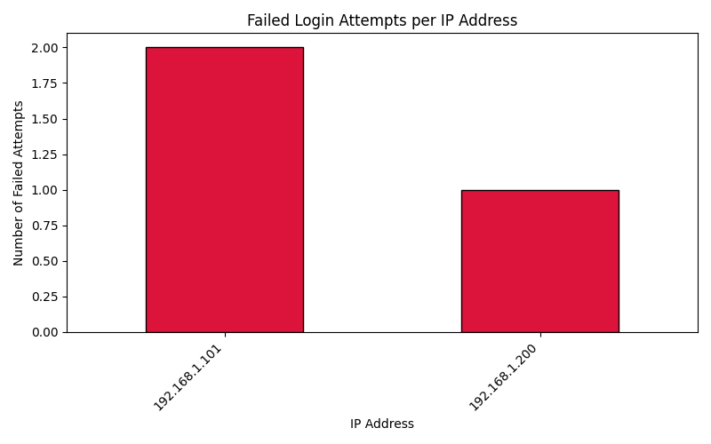

# 🔐 Suspicious Login Attempt Analyzer

This project is a simple Python-based cybersecurity tool that analyzes system authentication logs (like Linux `auth.log`) to detect suspicious login attempts, such as multiple failed logins from the same IP address.  

It’s a great showcase of using Python for log analysis, data visualization, and incident detection — all core cybersecurity skills.

---

## 📂 Project Structure
login-attempt-analyzer/
│
├── data/              # sample log files
├── scripts/
│   └── analyze_logins.py
├── notebooks/
│   └── login_analysis.ipynb
├── README.md
└── requirements.txt

---

## ⚙️ Features
✅ Parses raw system log files  
✅ Detects repeated failed login attempts  
✅ Identifies suspicious IPs  
✅ Generates a bar chart of failed attempts per IP  
✅ Outputs a summary report in the terminal  

---

## 🚀 How to Run

### 1️⃣ Clone the Repository
```bash
git clone https://github.com/<your-username>/login-attempt-analyzer.git
cd login-attempt-analyzer

2️⃣ Set Up Virtual Environment

python -m venv venv
.\venv\Scripts\activate

3️⃣ Install Dependencies

pip install pandas matplotlib

4️⃣ Run the Analyzer

cd scripts
python analyze_logins.py

The script will:

    Parse the sample auth.log file

    Print all login attempts

    Display and save a bar chart of failed attempts

📊 Visualization

Here’s a quick look at which IPs attempted the most failed logins:

🛠️ Technologies Used

    Python 3

    pandas — data parsing and aggregation

    matplotlib — visualization

    regex — extracting info from logs


## 📊 Visualization

Here’s a quick look at which IPs attempted the most failed logins:



### 🔎 Threat Intelligence Integration (Step 7)
The analyzer now integrates with the **AbuseIPDB API** to:
- Automatically verify suspicious IPs
- Display their **Abuse Confidence Score**
- Report how often each IP was flagged globally
- Show country, ISP, and usage type (e.g., VPN, Hosting)

## 🔐 Security Best Practices
Sensitive data such as API keys are stored in a `.env` file and **excluded from version control**.
This follows best cybersecurity practices for environment-based configuration.
